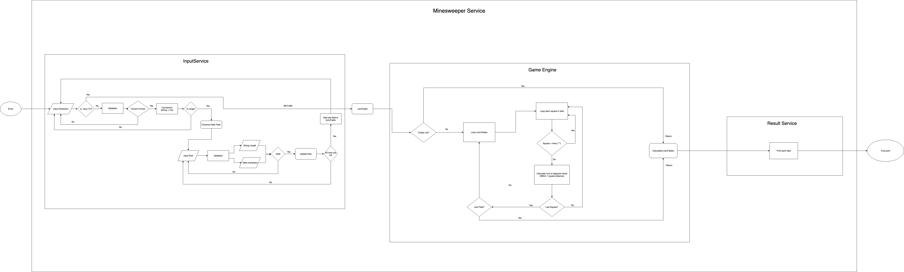

# Minesweeper Kata.

## About Minesweeper game
- [Minesweeper Kata description](https://github.com/MYOB-Technology/General_Developer/blob/master/katas/kata-minesweeper/kata-minesweeper.md)
- Player creates mine field and plants the mine by typing in the dimension and the row of each field
- Computer will calculate the number of adjacent mine squares and replace the safe square with that number
- Player can create multiple fields, the game only stops accepting input after player entering "0 0"

## Demo

```

Please input dimension to create a new mine field.
It should be 2 numbers separated by a white space. Both dimensions need to be from 1 to 100.
If you no longer wants to create new fields, type in 0 0

4 4
Please plant the mines for each row.
Put '*' where you want the mine to be, '.' where there's no mine.
No other characters are allowed.
Please enter the correct number of characters (the dimension you specified - row of length 3 cannot have 4 or more characters or 2 or fewer characters; same with column)
*...
....
.*..
....
Field is created

Please input dimension to create a new mine field.
It should be 2 numbers separated by a white space. Both dimensions need to be from 1 to 100.
If you no longer wants to create new fields, type in 0 0

3 1000
Dimensions out of range
hello world
Invalid dimension format. Make sure there is only 1 space between 2 numbers
3 5
Please plant the mines for each row.
Put '*' where you want the mine to be, '.' where there's no mine.
No other characters are allowed.
Please enter the correct number of characters (the dimension you specified - row of length 3 cannot have 4 or more characters or 2 or fewer characters; same with column)
**...
.....
..............
Invalid characters or number of characters in a row
.*...
Field is created

Please input dimension to create a new mine field.
It should be 2 numbers separated by a white space. Both dimensions need to be from 1 to 100.
If you no longer wants to create new fields, type in 0 0
0 0

All fields are calculated. Results: 

Field #1:
*100
2210
1*10
1110

Field #2:
**100
33200
1*100

```

## Rules & Assumptions

### Dimensions of Field
- First line of input has to be dimensions of the field
- Dimensions should be in the format of 2 numbers (row, column) separated by ONE white space. i.e "5 5"
- 0 <= row, column <= 100
- To stop creating new field, enter "0 0"
- Any invalid input will be ignored and player will be asked to re-enter the input

### Content of Field
- Must only include 2 kinds of characters: "*" represents a mine square, "." represents a safe square
- Number of squares for each row must match exactly the dimension specified
- Any invalid input will be ignored and player will be asked to re-enter the input

### Adjacent squares
- Adjacent here means within 1 square distance

## Requirements
- IntelliJ IDEA Ultimate 2019.2
- JDK 11.0.4
- JUnit 4
- Mockito 1.x

## How to run
* Clone the repository
```
git clone git@github.com:nguyenhailong253/Minesweeper.git
```

- Open IntelliJ
- File -> New -> Project from Existing Sources -> select the cloned folder -> Import project from external model -> Gradle -> Finish -> Import Gradle project (on bottom right popup window)
- Open MinesweeperApplication file -> run main()

## Testing
- Right click on Minesweeper folder
- Select "Run 'Tests in 'Minesweeper''"

## Diagram
